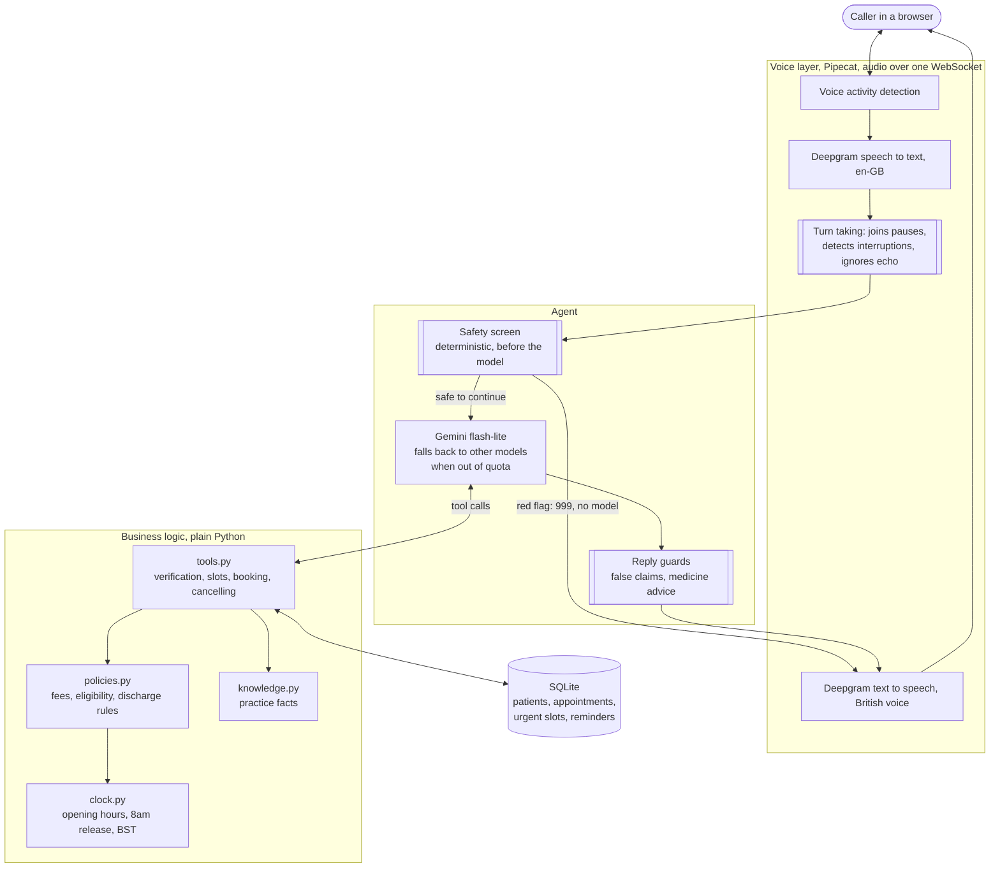

# Sophia, an AI voice receptionist for a UK dental practice

> **Unofficial concept demo. Not affiliated with, endorsed by, or connected to Museum Street Dental Practice.**
> Every patient record in this repository is invented. Every clinician named in it is a fictional character.
> No real patient data has been used at any point.

Sophia answers the phone for a busy NHS and private dental practice, and
rings patients back. She screens for dental emergencies before anything
else, books, moves and cancels appointments, quotes the right fee for the
right patient, explains practice policy honestly, lets callers talk over
her, and takes a message when she cannot help.

She runs entirely on free tiers and open source. Total cost to build and
run: nothing.

---

## Contents

- [Why a dental practice](#why-a-dental-practice)
- [What Sophia can do](#what-sophia-can-do)
- [Design principle: the model talks, the code decides](#design-principle-the-model-talks-the-code-decides)
- [Architecture](#architecture)
- [Evaluation](#evaluation)
- [Running it](#running-it)
- [Tech stack, and why](#tech-stack-and-why)
- [Repository layout](#repository-layout)
- [Engineering log](#engineering-log)
- [Data and modelling notes](#data-and-modelling-notes)
- [Assumptions and limitations](#assumptions-and-limitations)
- [Sources](#sources)

---

## Why a dental practice

UK dental access is under real pressure, and that pressure lands on the
phone.

- Only about **40% of adults in England** were seen by an NHS dentist in
  the two years to March 2026 (Healthwatch, August 2026).
- The share of practices offering NHS treatment fell from roughly **65% in
  2017 to 56% in 2026** (Nuffield Trust analysis).
- Patients are routinely advised to ring several practices on the same day,
  and some ring weekly looking for an opening. Every one of those calls is
  answered by a human receptionist.
- UK dental AI receptionists are already sold commercially, with one London
  provider pricing setup from around £3,500 plus £300 to £600 per month. The
  market already pays for this.

The practice modelled here has a public booking workflow with gaps a voice
agent is well suited to:

| Gap in the public workflow | What Sophia does about it |
|---|---|
| NHS appointments cannot be booked online or by email, phone only | Takes NHS bookings by voice |
| Urgent appointments released by phone from 8am, limited number per day | Enforces the 8am release, offers only what is genuinely left |
| Closed 1pm to 2pm every weekday, and all weekend | Still answers, books future slots, gives out of hours numbers |
| The practice no longer sends reminders to book check ups | Rings patients the day before, and when they are due a check up |
| Registration lapses silently after three years | Detects the lapse and quotes the correct new patient fee |

---

## What Sophia can do

**Clinical safety before anything else.** What the caller says is screened
by deterministic code before the model sees it. Red flag symptoms, such as
swelling with difficulty breathing, get an immediate instruction to ring
999 without waiting on the model, and no booking is offered. Same day problems are
offered today's urgent appointments. She never diagnoses, and a reply
containing a medicine dose is replaced before the caller hears it.

**Identity before information.** Full name, date of birth and postcode are
confirmed before anything is revealed or changed. A mismatch reveals
nothing, including which detail was wrong. The postcode must be one the
caller actually said: the model was once caught inventing one.

**Bookings that respect real rules.** New patient versus routine
examination, the three year registration lapse, NHS bands versus private
fees, hygienist direct access, the lunch closure, clinician specific
working days, and time of day requests like "after two o'clock".

**Honest cancellations.** Cancelling inside 24 hours is explained as a Short
Notice Cancellation before it is recorded, with a warning if the patient
is close to being removed from the practice list.

**Honest answers about NHS places.** Capacity is limited and the waiting
list is paused. Sophia says so, offers to take details for a callback, and
mentions the private route, rather than inventing availability.

**Outbound reminder calls.** Sophia rings patients the day before an
appointment, and recalls patients overdue a check up before their
registration lapses. If someone else answers,
she reveals nothing, and not because a prompt asks her not to: until the
right patient is verified, the model has not been told anything to reveal.

**A real phone manner.** Callers can interrupt her. Her own voice echoing
back through a phone speaker is recognised and ignored, so she does not
cut herself off. Sentences split by a pause are treated as one.

**Honest about what she is and what she knows.** She says she is an AI in
the first sentence and whenever asked. Anything outside the data becomes a
message for the human team.

---

## Design principle: the model talks, the code decides

The model's job is to understand the caller and choose a tool. It does not
hold the fee list, the opening hours or the cancellation policy in its
head, and it is never trusted with arithmetic on dates.

Every rule that could give a caller wrong information lives in Python and
SQLite, and is enforced by tests rather than requested in a prompt:

- Availability, fees and policy come from the database, never from memory.
- Every patient tool raises before doing anything if the caller has not
  been verified. That is an `if` statement, and no conversation talks past it.
- A cancellation refuses to run without an explicit confirmation flag, so
  the warning cannot come after the record is written.
- A reply claiming a booking or a verification that the call state
  contradicts is replaced before the caller hears it. Both happened in
  testing, despite prompt rules forbidding them.

This project learned the hard way that a rule in a prompt is a preference.
The [engineering log](docs/ENGINEERING_LOG.md) has the examples.

---

## Architecture



Two positions in that diagram are deliberate. The safety screen sits
**before** the model, so an emergency never waits on it or depends on it.
The reply guards sit **after** the model, so what the caller hears is
checked against what actually happened on the call.

The audio travels over one WebSocket on the same HTTPS connection as the
page. It started as WebRTC, which connects peer to peer and failed for
every caller not on the machine running the server. See entry 22 of the
engineering log.

---

## Evaluation

Unit tests prove the loop, the tools and the guard rails. They cannot
prove what the real model does with a real caller, which is where nearly
every serious bug in this project was found. So there are two layers.

**487 unit tests**, run with no API key and no network:

```bash
python -m pytest -q
```

**A scenario suite against the real model**, in `evals/`: 20 scripted calls
drawn from the practice's real rules, including a booking, the lapsed
patient fee, urgent slots before and after 8am, a 999 red flag, cancelling
30 and 5 hours ahead, a wrong date of birth, a medicine question, weekend
and lunchtime requests, a change of mind, and two outbound reminder calls,
one answered by someone other than the patient.

```bash
python scripts/run_evals.py --repeat 3
```

Scenarios are judged on outcomes, never on wording: what was written to the
database and at what fee, which tools ran in what order, whether a warning
came before an action. Each failure is attributed to a layer, generation,
retrieval, tool logic or safety, because the fix differs for each.

The script writes `docs/EVAL_RESULTS.md`: pass rates, turn latency, failures
by layer, and the transcript of every failure.

**Latest full run: 57 of 60 passed**, all 20 scenarios three times each
against `gemini-3.5-flash-lite`, with 167 of 171 individual checks passing
and a median agent turn of 2.73 seconds. The 3 failures were all one
scenario and one bug, and not the model's: a husband answering a reminder
call said "can I take a message", the medicine rule mistook it for a
medicine question, and Sophia's goodbye gained a pharmacist referral that
mentioned an appointment. After the fix, the three scenarios it could
affect passed 9 of 9. The report keeps the failing transcripts.

**Voice latency**, measured with `scripts/measure_latency.py`: a second
voice speaks into a real call, and the wait is timed from the caller's last
word to Sophia's first audio, over 10 ordinary turns and 2 red flags in 2 calls.

| Turn | Median | p90 |
|---|---|---|
| Ordinary question, with model and tools | 4.15s | 4.72s |
| of which the model and tools | 2.38s | 2.89s |
| 999 red flag, no model | 1.77s | |

Of the 1.77 seconds the voice layer costs on its own, 1.2 is a deliberate
pause to be sure the caller has finished, because answering half a
sentence was a worse failure in testing than a short wait. Measured on
the same machine as the server, so a real caller's network comes on top.

What building the suite taught is worth recording here. It found one real
bug: asked for "something in the afternoon", Sophia said there were no
afternoon appointments when the afternoons were almost empty, because the
slot search could not filter by time of day. The report first blamed the
model; the transcript showed the tool. The suite also failed Sophia twice
for bugs in its own checks, for saying "twenty-seven pounds ninety" and
"twenty-four hours" in words, and a third check was lenient enough to pass
a real leak spoken as "eleven in the morning". Attribution tells you where
to look first. The transcript is still the evidence.

---

## Running it

Requires Python 3.11 or newer.

```bash
python -m venv .venv
.venv\Scripts\activate
pip install -r requirements.txt
copy .env.example .env
python scripts/init_db.py
python -m pytest -q
```

The data layer and every unit test work with no keys at all.

**Talk to Sophia in text.** Needs a free Gemini key in `.env`.

```bash
python scripts/chat.py --show-tools
python scripts/chat.py --at "2026-09-21 07:45"
```

`--show-tools` prints every tool call, the quickest way to see she is not
inventing anything. `--at` pins the clock, to show rules like the 8am urgent
release without waiting for one.

**Talk to Sophia by voice.** Also needs a free Deepgram key.

```bash
python -m uvicorn sophia.voice_app:app --app-dir src --port 7861
```

Then open http://localhost:7861, press Start call, and allow the microphone.
The call list on the page places outbound reminder calls: press Answer to
play the person picking up.

**Share it with other people.** A Cloudflare quick tunnel gives the local
server a public HTTPS address, free and with no account:

```bash
winget install --id Cloudflare.cloudflared
cloudflared tunnel --url http://localhost:7861 --protocol http2
```

`--protocol http2` matters on networks that block outbound UDP, which
includes many offices. The default QUIC connection to Cloudflare runs over
UDP there, and dropped every call after a minute or two. The address
changes each time the tunnel starts, and the link works only while the
machine running the server is awake.

Each tester gets their own copy of the fake patients and their own
transcript, kept by a random id in their browser, so people can test at
the same time without taking each other's slots. **Reset my demo data** on
the page puts theirs back as it started.

[`docs/TESTING.md`](docs/TESTING.md) is a guide for testers: which fake
patient to use for each flow, what to say, and what a correct answer is.

**Check the setup.**

```bash
python scripts/check_setup.py
python scripts/list_models.py
```

Model names change without notice. `list_models.py` asks the provider what
your key can actually use, which on one occasion was not what its own
documentation said.

On Windows, `tzdata` is required and is in `requirements.txt`, because
Windows has no system timezone database.

---

## Tech stack, and why

| Piece | Choice | Reason |
|---|---|---|
| Language model | Gemini `gemini-3.5-flash-lite` | Free tier, tool calling intact, under a second per request when measured |
| Fallback models | `gemini-3-flash-preview`, `gemini-3.1-flash-lite`, then Groq `openai/gpt-oss-120b` | Tried in order when a model is out of quota or overloaded. Each Gemini model has its own daily quota. They keep a call going, but are slower and make more mistakes, so they are a backstop rather than an equal |
| Speech to text | Deepgram `nova-3`, en-GB | UK English matters for postcodes, surnames and "twenty past nine" |
| Text to speech | Deepgram `aura-athena-en` | British, calm and professional, chosen by listening |
| Voice pipeline | Pipecat, audio over a WebSocket | Open source, and no phone number means no cost |
| Database | SQLite | Zero setup, and the rules need a real relational model |
| Practice facts | Keyword retrieval over markdown | Eight short documents with a fixed vocabulary. It passes every retrieval test and returns nothing rather than a weak match. Embeddings would have added a 2.5 GB download for no measured gain |
| Tests | pytest, plus a scenario suite | Deterministic rules offline, real model behaviour as pass rates |

Every model name and package version was checked against the live service
or PyPI, not assumed. Two of the defaults written from memory on the first
day turned out to be wrong: a retired model, and an American voice.

---

## Repository layout

```
data/
  practice_info/    Practice facts as markdown, rewritten in our own words
  seed/             Invented clinicians, the real fee structure, fake patients
src/sophia/
  config.py         Every constant, model name and key, keys hidden from logs
  clock.py          Opening hours, the 8am urgent release, spoken UK dates, BST
  db.py             SQLite schema and the seeder
  policies.py       Business rules as pure, tested functions
  tools.py          What the model may call, and everything it may not
  schemas.py        Tool definitions, kept small for the free tier
  prompts.py        The system prompt, deliberately short and holding no facts
  knowledge.py      Retrieval over the practice documents
  safety.py         Emergency screening and the medicine rule
  agent_text.py     The conversation loop and the reply guards
  providers.py      Gemini and Groq behind one interface
  outbound.py       Reminder calls, and what may be known before verification
  voice_app.py      The voice pipeline, turn taking and the web server
  sessions.py       A private copy of the demo data per tester
  web_audio.py      The wire format for call audio
evals/              The scenario suite: framework and scripted calls
scripts/            init_db, chat, check_setup, list_models, run_evals
tests/              487 unit tests
web/                The call page, transcript and outbound call list
docs/               Engineering log, evaluation results, architecture diagram
```

---

## Engineering log

[`docs/ENGINEERING_LOG.md`](docs/ENGINEERING_LOG.md) records every bug found
during the build: what the symptom looked like, what the cause turned out
to be, and what changed. It exists because the causes were rarely where the
symptoms pointed.

One representative entry. Asked for the opening hours, Sophia answered nine
to six with Saturday mornings. The real hours are eight to six, weekdays
only, closed one to two. She had called no tool. The prompt already said,
in capitals, that she knows nothing a tool has not told her, and that was
never going to be enough, because no tool could answer the question. You
cannot instruct a model out of a capability gap.

Others include a British Summer Time bug that would have misjudged
cancellations every October, a confirmed booking that was never written, a
model inventing a postcode, a database connection that silently broke every
voice booking, and her own echo making her interrupt herself.

---

## Data and modelling notes

**Nothing is copied from the practice website.** The facts were read, then
rewritten into structured data and plain markdown.

**Invented clinicians.** Six, with the real role structure: a principal
dentist, a partner, a second associate, a dentist with a special interest
in root canal treatment, and two hygiene therapists. The real practice has
far more dentists; a smaller set makes availability legible in a demo.

**Fake patients, built around edge cases.** Twelve, each there to exercise
a rule: a lapsed registration, a new patient one short notice cancellation
from discharge, an existing patient two away, a failure to attend on
record, a child with a guardian, someone for the wrong date of birth test.

**Dates are relative, not fixed.** Seed data is stored as offsets from the
day the database is built, so the demo never goes stale, and appointments
that would land on a weekend, in the lunch hour, in the past, or on a
clinician's day off are moved to a real free slot.

**Times are stored as local wall clock.** The reasoning, and why it is safe
here, is at the top of `src/sophia/clock.py`.

---

## Assumptions and limitations

Choices made where public information was incomplete or contradictory, and
limits of the demo, written down rather than hidden.

- **The urgent release time is inconsistent in public.** One page says ring
  from 8am, another says 9am to 5pm. This project uses 8am.
- **"New patient" in the attendance policy is not defined publicly.** This
  project assumes less than 12 months at the practice.
- **The number of hygiene therapists is unknown.** Two are modelled.
- **Several fee categories are not modelled**, including fillings, imaging, implants,
  whitening, crowns, orthodontics and dentures. For anything not in the price table,
  Sophia takes a message rather than guessing.
- **The NHS website and the practice website disagree on new NHS patients.**
  Sophia answers honestly about limited capacity rather than picking a side.
- **Free tier limits.** Gemini's free tier allows 15 requests a minute and
  500 a day per model, and one caller turn with tool calls can be several
  requests. A few simultaneous callers can reach the first; a day of
  testing plus a full evaluation reached the second. When that happens
  Sophia moves to the next model in a fallback list, so calls keep
  working, but measurably worse. In live tests, turns that take about 3
  seconds on the primary took 9 to 33, and a call on the fallbacks booked a
  slot the caller had not clearly chosen. The evaluation suite measures
  the primary alone unless run with `--fallback`.
- **No real telephony.** Calls run in a browser. A real phone number costs
  money and proves nothing extra in a demo.
- **Demo sessions live on one laptop.** Each tester's data is a copy of
  the seeded database, kept for as long as the server runs. A restart, or
  more than a hundred testers, starts people again from fresh data.
- **Not a production system.** Health data is special category data under
  UK GDPR. A real deployment would need a data processing agreement, UK
  hosting, retention rules, human clinical oversight and an audited safety
  review. None of that is in scope.

---

## Sources

- Practice website and NHS.uk profile, read 16 September 2026, for opening
  hours, fees, booking routes and the attendance policy.
- NHS guidance on finding an emergency NHS dentist, and on dental abscess,
  nhs.uk, checked 16 September 2026, for the 999 red flags. The project's
  own draft list was **wrong** before that check, and was corrected: NHS
  wording is severe swelling of the mouth, lips, throat or neck **together
  with** difficulty breathing or opening one or both eyes, and it also names
  head or face injury causing loss of consciousness, vomiting or double
  vision.
- NHS dental charges for England, bands effective 1 April 2026.
- Healthwatch, August 2026, on NHS dental access.
- Nuffield Trust analysis on the share of practices offering NHS treatment.

---

## Future work

Real telephony over SIP, integration with a practice management system such
as SOE Exact or Dentally, SMS confirmations, waiting list management,
automatic failover between model providers when a free tier limit is hit,
multilingual support, and reporting on how many missed calls were recovered.
