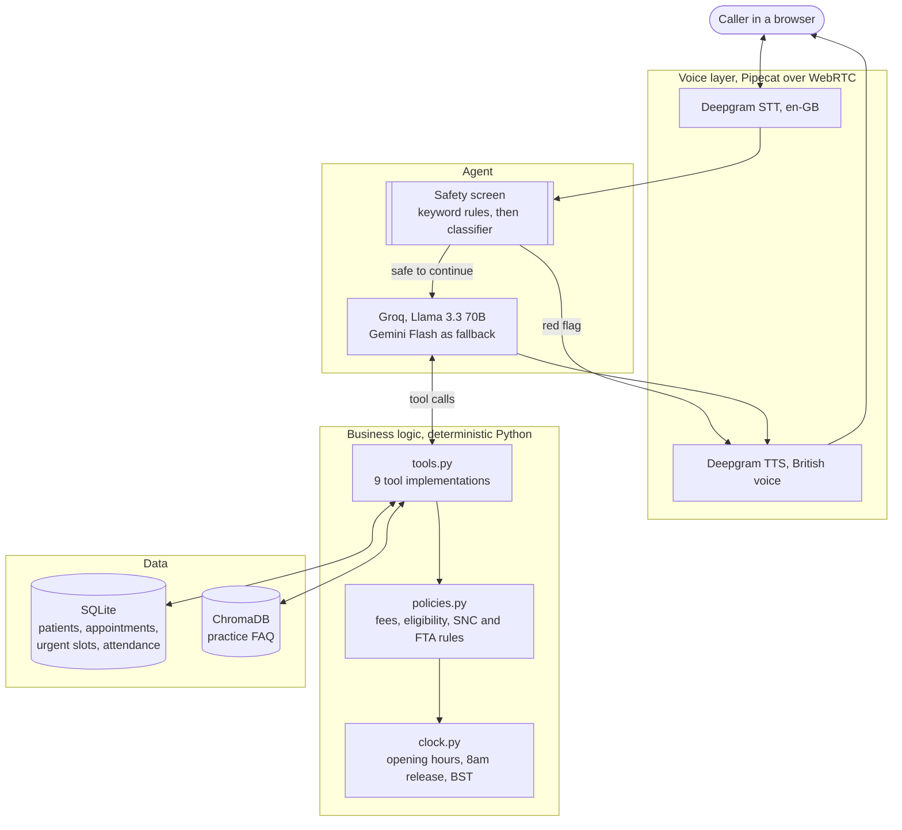

# Sophia, an AI voice receptionist for a UK dental practice

> **Unofficial concept demo. Not affiliated with, endorsed by, or connected to Museum Street Dental Practice.**
> Every patient record in this repository is invented. Every clinician named in it is a fictional character.
> No real patient data has been used at any point.

Sophia answers the phone for a busy NHS and private dental practice. She
screens for dental emergencies, books and cancels appointments, quotes the
right fee for the right patient, explains practice policy honestly, and
takes a message when she cannot help.

She runs entirely on free tiers and open source. Total cost to build and
run: nothing.

**Status: in progress.** Day 1 of an 8 day build. See [Progress](#progress).

---

## Why a dental practice

UK dental access is genuinely under pressure, and the pressure lands on the
phone.

- Only about **40% of adults in England** were seen by an NHS dentist in
  the two years to March 2026 (Healthwatch, August 2026).
- The share of practices offering NHS treatment fell from roughly **65% in
  2017 to 56% in 2026** (Nuffield Trust analysis).
- Patients are routinely advised to ring several practices on the same day,
  and some ring weekly looking for an opening. Every one of those calls is
  answered by a human receptionist.
- UK dental AI receptionists are already sold commercially, with one London
  provider pricing setup from around £3,500 plus £300 to £600 per month. The
  market already pays for this.

The practice modelled here has a public booking workflow with several
visible gaps that a voice agent is genuinely well suited to:

| Gap in the public workflow | What Sophia does about it |
|---|---|
| NHS appointments cannot be booked online or by email, phone only | Takes NHS bookings by voice |
| Urgent appointments released by phone from 8am, limited number per day | Enforces the 8am release, offers what is genuinely left |
| Closed 1pm to 2pm every weekday, and all weekend | Still answers, books future slots, gives out of hours numbers |
| The practice no longer sends reminders to book check ups | Outbound recall and day before reminder calls |
| Registration lapses silently after three years | Detects the lapse and quotes the correct new patient fee |

---

## What Sophia can do

**Clinical safety first.** Before anything else, an urgent call is screened.
Red flag symptoms get a clear instruction to call 999 and the booking flow
stops. Same day problems are offered an urgent slot. Sophia never diagnoses
and never advises on medication.

**Identity before information.** Full name, date of birth and postcode are
confirmed before any appointment detail is revealed or changed. A mismatch
reveals nothing at all.

**Bookings that respect real rules.** New patient versus routine
examination, the three year registration lapse, NHS bands versus private
fees, hygienist direct access eligibility, the lunch closure, and clinician
specific working days.

**Honest cancellations.** Cancelling inside 24 hours is explained plainly as
a Short Notice Cancellation before it is recorded, along with a warning if
the patient is close to being discharged.

**Honest answers about NHS places.** Capacity is limited and the waiting
list is paused. Sophia says so, offers to take details for a callback, and
mentions the private route, rather than inventing availability.

**Knows what she does not know.** Anything outside the data becomes a
message for the human team.

---

## Design principle: the model talks, the code decides

The language model's only job is to understand the caller and choose a
tool. It does not hold the fee list, the opening hours, or the cancellation
policy in its head, and it is never trusted to do arithmetic on dates.

Every rule that could give a caller wrong information lives in Python and
SQLite, enforced by tests:

- Availability comes from the database, not from the model.
- Fees come from a price table keyed by eligibility, not from the model.
- Whether a cancellation is short notice is computed in code, not judged by
  the model.
- A booking tool refuses to run at all if the patient has not been verified.

This is the difference between a demo that sounds convincing and one that
is safe to put in front of a patient.

---

## Architecture



The safety screen sits **before** the model in the path, not after it. A
caller describing difficulty breathing gets the 999 instruction from
deterministic code, without waiting on a model to decide.

---

## Tech stack, and why

| Piece | Choice | Reason |
|---|---|---|
| Voice transport | Pipecat, browser WebRTC | Open source, and no phone number means no cost |
| Speech to text | Deepgram, `nova-3`, en-GB | Free signup credit, UK English matters for postcodes and names |
| Text to speech | Deepgram Aura, British voice | Same credit, same pipeline, low latency |
| Language model | Groq, `llama-3.3-70b-versatile` | Free tier, and fast inference is what makes voice feel natural |
| Fallback model | Gemini Flash | Free tier, switchable with one config value |
| Database | SQLite | Zero setup, and the rules need a real relational model |
| FAQ retrieval | ChromaDB and `all-MiniLM-L6-v2` | Keeps practice facts out of the prompt, which protects the free tier |
| Tests | pytest | Policy rules, safety screening, and scripted conversations |

All model names and package versions were checked against official sources
on 16 September 2026, not assumed.

---

## Repository layout

```
data/
  practice_info/    Practice facts as markdown, rewritten in our own words, indexed for retrieval
  seed/             Invented clinicians, the real fee structure, fake patients
src/sophia/
  config.py         Every business constant and model name in one place
  clock.py          Opening hours, the 8am urgent release, spoken UK dates, BST handling
  db.py             SQLite schema and the seeder
scripts/
  init_db.py        Rebuild the demo database from scratch
tests/              Schema, seed integrity and time handling, so far
docs/               Architecture diagram
```

---

## Running it

Requires Python 3.11 or newer.

```bash
python -m venv .venv
.venv\Scripts\activate
pip install -r requirements.txt
copy .env.example .env
python scripts/init_db.py
python -m pytest tests/ -q
```

`.env` needs no keys for the data layer or the tests. Keys are only needed
once the agent itself runs.

On Windows, `tzdata` is required and is in `requirements.txt`. Windows has
no system IANA timezone database, so `Europe/London` is otherwise
unavailable to Python.

---

## Data and modelling notes

**Nothing here is copied from the practice website.** The facts were read,
then rewritten into structured data files and plain markdown.

**Invented clinicians.** Six of them, with the real role structure: a
principal dentist, an associate dentist who is also a partner, a second
associate, a dentist with a special interest in root canal treatment, and
two hygiene therapists. The real practice has far more dentists. A smaller
set makes availability legible in a demo.

**Fake patients, built around edge cases.** Twelve of them, each one
existing to exercise a specific rule: a lapsed registration, a new patient
one short notice cancellation away from discharge, an existing patient two
away, a failure to attend on record, a child with a guardian, someone for
the wrong date of birth test.

**Dates are relative, not fixed.** Patient history and appointments are
stored in the seed data as offsets from the day the database is built, so
the demo is never stale. The seeder also moves any seeded appointment that
would land on a weekend, in the lunch hour, in the past, or on a day that
clinician does not work.

**Times are stored as local wall clock.** The reasoning, and why that is
safe here, is written out at the top of `src/sophia/clock.py`.

---

## Sources

- Practice website and NHS.uk profile, read 16 September 2026, for opening
  hours, fees, booking routes and the attendance policy.
- NHS guidance on finding an emergency NHS dentist, and on dental abscess,
  nhs.uk, checked 16 September 2026, for the 999 red flag list. The draft
  list in this project was **wrong** before that check: NHS wording is
  severe swelling of mouth, lips, throat or neck **together with**
  difficulty breathing or difficulty opening one or both eyes, and it also
  names head or face injury causing loss of consciousness, vomiting or
  double vision. Both were corrected.
- NHS dental charges for England, bands effective 1 April 2026.
- Healthwatch, August 2026, on NHS dental access.
- Nuffield Trust analysis on the share of practices offering NHS treatment.

---

## Assumptions and limitations

These are choices made where the public information was incomplete or
contradictory, written down rather than hidden.

- **The urgent release time is inconsistent in public.** One page says ring
  from 8am, another says 9am to 5pm. This project uses 8am.
- **"New patient" in the attendance policy is not defined publicly.** This
  project assumes less than 12 months at the practice.
- **The number of hygiene therapists is unknown.** Two are modelled.
- **Several fee categories are not modelled**, including fillings, imaging,
  implants, whitening, crowns, orthodontics and dentures. For anything not
  in the price table, Sophia takes a message rather than guessing.
- **Conflicting public information on new NHS patients.** The NHS website
  and the practice website disagree. Sophia is written to answer honestly
  about limited capacity rather than to pick a side.
- **No real telephony.** Calls run in the browser. A real phone number costs
  money and proves nothing extra in a demo.
- **Not a production system.** Health data is special category data under UK
  GDPR. A real deployment would need a data processing agreement, UK
  hosting, retention rules, human clinical oversight and an audited safety
  review. None of that is in scope here.

---

## Progress

| Day | Goal | Status |
|---|---|---|
| 1 | Repo, clinic data, SQLite schema and seed | Done |
| 2 | Text agent with tool calling against SQLite | Not started |
| 3 | Policy logic, FAQ retrieval, safety escalation | Not started |
| 4 | Voice layer, browser call end to end | Not started |
| 5 | Voice polish, interruptions, latency | Not started |
| 6 | Scenario eval suite and latency measurement | Not started |
| 7 | Demo video and documentation | Not started |
| 8 | Final checks | Not started |

**Day 1 result:** 42 tests passing. Schema of 9 tables, 6 clinicians, 22
appointment types, 12 fake patients, 90 urgent slots across three weeks.

One of those tests earned its place immediately. The British Summer Time
case failed on first run and exposed a real bug: Python defines subtraction
between two aware datetimes sharing the same `tzinfo` object as wall clock
arithmetic, silently ignoring the timezone. Ten in the morning on Saturday
24 October to ten on Sunday 25 October came back as 24 hours when 25 hours
have actually passed. Since 24 hours is exactly the line between a normal
cancellation and a Short Notice Cancellation, that would have mis-judged
real cancellations every October. Fixed by converting to UTC before
subtracting, with the reason written into the code.

---

## Future work

Real telephony over SIP, integration with a practice management system such
as SOE Exact or Dentally, SMS confirmations, waiting list management,
multilingual support, and analytics on how many missed calls were
recovered.
